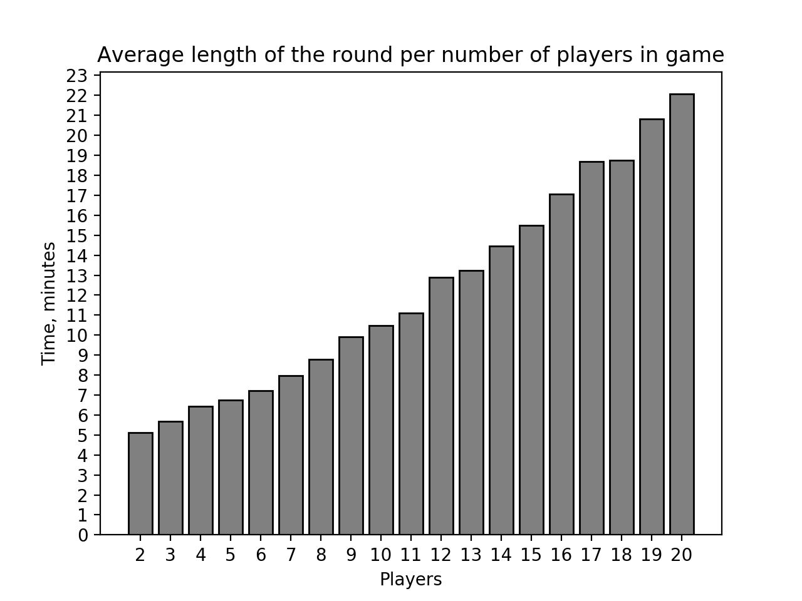

# Cee-lo
## Introductiction
There are many different dice games.

## About
Cee-lo is a gambling game played with three six-sided
dice. There is not one standart set of rules, but there
are some constants that are hold true all the time, one
of which is the number fo dice - three. [Wikipedia](https://en.wikipedia.org/wiki/Cee-lo)

This specific implementation focuses on the Cee-lo
without a bank (Winner Take All). 

## Rules
In this version of the game, each round involves two or
more players of equal status. A bet is agreed upon and
each player puts that amount in the pile or pot. Each
player then has to roll a three dice at once, if a
player rolls one of the winning combinations in this case
*4-5-6* or *trips* (three same numbers), that player is
eligible to claim the pot. If one the players is eligible
to claim the pot all other players have to roll the rice.
If one of the players rolls a winning combination the
eligible player loses the privilege to the pot, all
players add the bet to the pot and round starts over.
If none roll a winning combination, eligible player takes
the pot.  

## Interesting questions
There are many different questions that can be adressed about this game, some of which are:
- How long does it take to win a pot?
- What is the average winning pot size?  

Note that in order to anwsers these questions, we need to know, what time on average does a player take to make a turn and what is the bet. 
### How long does it take to win a pot?

This graph illustrates the dependecy between the number of players and the average time length of the round. Real-life experiemtns showed that a player takes in average 15 seconds to complete a turn. This time in held constant in this simulation. Average time is calculated by simulating 1000 rounds of the game. It is reasonable to assume by looking at the graph that as the number of players incearses, the time to complete a round would grow exponentially.  

### What is the average winning pot size?

This graph depicts the dependecy between the number of players and the average average winning pot size. Note that for It is reasonable to assume that as the number of players incearses, the time to complete a round would grow exponentially.

